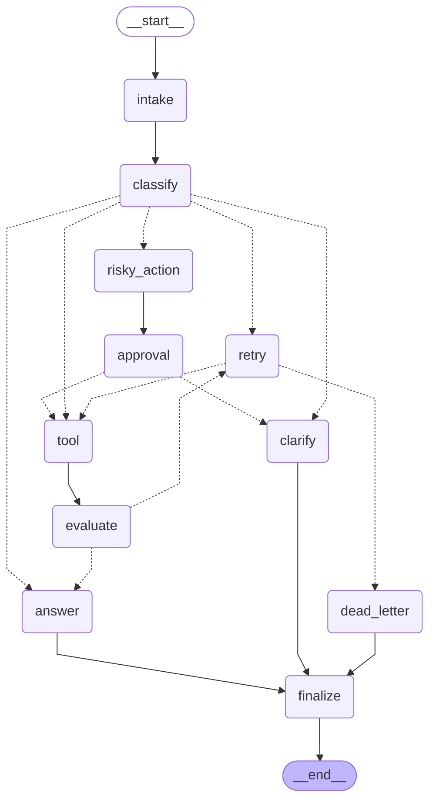

# Day 08 Lab Report

## 0. Student

- Name: Pham Manh Thang
- Student ID: 2A202600921
- Date: 2026-06-29

## 1. Metrics summary

| Metric | Value |
|---|---:|
| Total scenarios | 7 |
| Success rate | 100.00% |
| Avg nodes visited | 6.43 |
| Total retries | 3 |
| Total interrupts | 2 |
| Resume success | False |

## 2. Scenario results

| Scenario | Expected | Actual | Success | Retries | Interrupts |
|---|---|---|---:|---:|---:|
| S01_simple | simple | simple | ✅ | 0 | 0 |
| S02_tool | tool | tool | ✅ | 0 | 0 |
| S03_missing | missing_info | missing_info | ✅ | 0 | 0 |
| S04_risky | risky | risky | ✅ | 0 | 1 |
| S05_error | error | error | ✅ | 2 | 0 |
| S06_delete | risky | risky | ✅ | 0 | 1 |
| S07_dead_letter | error | error | ✅ | 1 | 0 |

## 3. Architecture

Graph: `START → intake → classify → [conditional route]`. Routes branch to `answer` (simple), `tool → evaluate` (tool, with a bounded retry loop via `evaluate → retry → tool`), `clarify` (missing_info), `risky_action → approval → tool` (risky, human-in-the-loop), and `retry` (error). Every path converges at `finalize → END`.

Graph diagram (auto-generated via `draw_mermaid()`):



## 4. State schema

| Field | Reducer | Why |
|---|---|---|
| messages / tool_results / errors / events | append | audit trail |
| route / risk_level / attempt / final_answer | overwrite | current value only |
| evaluation_result / approval / proposed_action / pending_question | overwrite | latest decision drives routing |

## 5. Failure analysis

1. **Transient tool failure**: `tool_node` returns an `ERROR` result; `evaluate_node` flags `needs_retry`; `route_after_retry` retries until `attempt >= max_attempts`, then escalates to `dead_letter` (no infinite loop).
2. **Risky action without approval**: risky routes are forced through `risky_action → approval`; `route_after_approval` only proceeds to `tool` when `approval.approved` is true, otherwise diverts to `clarify`.

## 6. Persistence / recovery

Compiled with a checkpointer; each run uses a per-scenario `thread_id` (`configurable.thread_id`). The default run uses `MemorySaver`; a SQLite backend (`SqliteSaver` + WAL) is implemented in `persistence.py`.

**Crash-resume evidence** — `scripts/persistence_demo.py` runs a scenario in one process, then a fresh process reopens the same SQLite file and recovers the state via `get_state()` / `get_state_history()` without re-running the graph:

```text
[process 1] route=tool final_answer='Thank you for your inquiry...'
--- simulated crash: new process, only reads the DB back ---
[process 2] RESUMED from SQLite -> route='tool', events=6
[process 2] state history checkpoints = 8 (time-travel available)
```

## 7. Improvement plan

Replace heuristic `evaluate_node` with an LLM-as-judge, add real `interrupt()`-based HITL, and persist checkpoints to SQLite for crash recovery.
